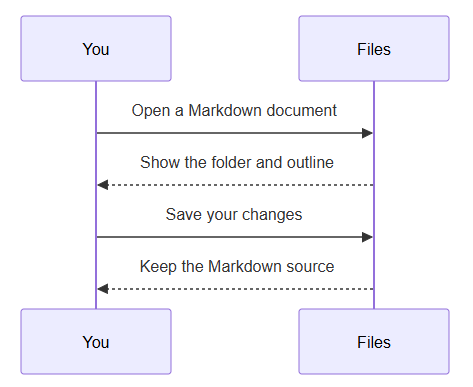
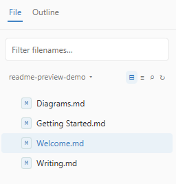
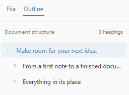
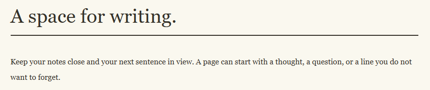

<p align="center"></p>

<h1 align="center">OpenTypora</h1>

<p align="center">Make room for words. Turn an idea into a document.</p>

<p align="center"><code>/* READ · WRITE · MARKDOWN */</code></p>

<p align="center"><strong>English</strong> · <a href="README.zh-CN.md">简体中文</a></p>

<p align="center">
  <a href="https://github.com/Cjy-CN/OpenTypora/releases/download/v0.1.4/OpenTypora-Setup-0.1.4-x64.exe"><strong>Download for Windows</strong></a>
  &nbsp; · &nbsp;
  <a href="https://github.com/Cjy-CN/OpenTypora/releases/download/v0.1.4/OpenTypora-Portable-0.1.4-x64.exe">Portable build</a>
  &nbsp; · &nbsp;
  <a href="https://github.com/Cjy-CN/OpenTypora/releases/latest">All downloads & release notes</a>
</p>

<p align="center"><sub>Windows x64 · v0.1.4 · Free & open source · MIT</sub></p>

<p align="center"></p>

<p align="center"><sub>From one small note to a finished document.</sub><br><br></p>

---

<h2 align="center">Read and write on the same page</h2>

<p align="center">Open a file and read. Click a paragraph and keep writing.<br>Move away, and headings, lists and text styles return to their reading view.</p>

| Live editing | Markdown source | Room to focus |
| :---: | :---: | :---: |
| Work on the current paragraph and see its formatting. | Use `Ctrl+/` for the source; both views share text and undo history. | Focus mode dims surrounding content. Typewriter mode keeps the active line near the center. |

<p align="center"></p>

<p align="center"><code>/* ONE SOURCE. TWO EDITING VIEWS. */</code><br><br></p>

---

<h2 align="center">Let plain text say more</h2>

<p align="center">Headings · Lists · Tasks · Tables · Images · Code · Equations · Diagrams</p>

<p align="center">Give your content structure with Markdown. Keep diagrams in code fences.<br>Render mathematics, Mermaid, and traditional sequence and flow diagrams while keeping the source editable.</p>

<h3 align="center">Give information its place</h3>

<p align="center">A few lines become a table. Tasks, categories and quotations each have room.</p>

<p align="center"></p>

<h3 align="center">Keep code and equations in the document</h3>

<p align="center"></p>

<h3 align="center">Draw the process</h3>

<p align="center"></p>

<p align="center"></p>

<p align="center"><code>/* DRAW THE PROCESS. EXPLAIN THE RESULT. */</code><br><br></p>

---

<h2 align="center">Stay with the content</h2>

<p align="center">Your files, outline and search are beside your writing.</p>

| Files close at hand | A path through long documents | Changes you can follow |
| :--- | :--- | :--- |
| Open an `.md` file and the window shows its folder. Filter filenames at the top, or search the folder's contents. | Navigate headings through the outline. Find and replace across the complete source with case, whole-word and regex options. | Save recovery drafts and detect external file changes. Views and themes continue to use the same source. |

<table>
  <tr>
    <td align="center" valign="top"><strong>Files and filename filtering</strong><br></td>
    <td align="center" valign="top"><strong>A map made of headings</strong><br></td>
  </tr>
</table>

<p align="center">Documents remain ordinary files in folders you control.<br>Start writing without importing your content into a proprietary database.<br><br></p>

---

<h2 align="center">Finish writing. Share the page.</h2>

<p align="center">Keep the Markdown, or deliver a document made for reading.</p>

<p align="center"></p>

<p align="center"><strong>HTML · PDF · Images</strong><br>Export with the built-in desktop renderer, and save independent profiles for different uses.</p>

<p align="center"><sub>Word, OpenDocument, RTF, Epub, LaTeX and other conversion formats require Pandoc.<br>LaTeX PDF also requires a compatible TeX engine. Missing dependencies produce configuration guidance.</sub><br><br></p>

---

<h2 align="center">Choose your page</h2>

<p align="center">Light, warm or dark. Change the atmosphere and keep writing the same document.</p>

<p align="center"><strong>Newsprint</strong> · Warm paper. Serif text.</p>

<p align="center"></p>

<p align="center"><strong>Night</strong> · A dark canvas. Clear structure.</p>

<p align="center"></p>

<p align="center"><sub>Built-in Github, Newsprint, Night, Pixyll and Whitey themes, plus custom document CSS.<br>The interface follows the system language or lets you select English or Simplified Chinese. Some export profile names and error messages remain in Chinese.</sub><br><br></p>

---

<h2 align="center">Start with one file</h2>

<p align="center"><a href="https://github.com/Cjy-CN/OpenTypora/releases/latest"><strong>Get a ready-to-run OpenTypora build →</strong></a></p>

1. Download `OpenTypora-Setup-0.1.4-x64.exe` from **Assets** in Releases and run setup. No Node.js or build tools are needed.
2. Launch from the Start menu, or right-click an `.md` file and choose **Open with OpenTypora**. On Windows 11, this may be under **Show more options**.
3. Use `Ctrl+O` to open, `Ctrl+S` to save and `Ctrl+/` to switch to source mode.

The installer provides shortcuts, a Markdown context-menu entry, Open with registration and an uninstaller. Uninstall through Windows **Settings → Apps**; documents, settings and recovery data are retained. Installation keeps your existing default Markdown editor.

Double-click `OpenTypora-Portable-0.1.4-x64.exe` to run without setup. The portable build does not automatically register context-menu entries or an uninstaller. Portable packaging does not imply that settings are stored beside the EXE.

<sub>Current builds target Windows x64 and are unsigned. Source code archives in Releases contain the source; download the matching EXE for the installer or portable application. SHA256SUMS.txt on the same release page contains file checksums.</sub>

---

## Build and contribute

Development environment: Windows x64, Node.js 24 and npm.

```powershell
git clone https://github.com/Cjy-CN/OpenTypora.git
cd OpenTypora
npm ci
npm run dev
```

Run checks relevant to your changes: `npm test`, `npm run typecheck` and `npm run build`. Desktop and real editor interaction checks are `npm run test:desktop` and `npm run test:editor`. Use `npm run package` for the installer and `npm run package:portable` for the portable build; after packaging, run `npm run test:installer` to verify installation and uninstallation.

Read [the collaboration instructions](AGENTS.md) and [engineering contracts](docs/工程基线与协作契约.md) before contributing. Report reproduction steps and a minimal Markdown example in [Issues](https://github.com/Cjy-CN/OpenTypora/issues).

The project is under active development. [Product requirements](docs/OpenTypora-产品需求文档.md) and [acceptance cases](docs/OpenTypora-验收用例.md) describe the full intended scope; this feature overview does not certify every acceptance case. See [the documentation](docs/README.md) for settings, dependencies and engineering details.

## License

OpenTypora is available under the [MIT license](LICENSE). Third-party components retain their respective licenses.

<p align="center"><a href="https://github.com/Cjy-CN/OpenTypora/releases/latest">Download</a> · <a href="docs/README.md">Documentation</a> · <a href="https://github.com/Cjy-CN/OpenTypora/issues">Issues</a> · <a href="LICENSE">MIT</a></p>
