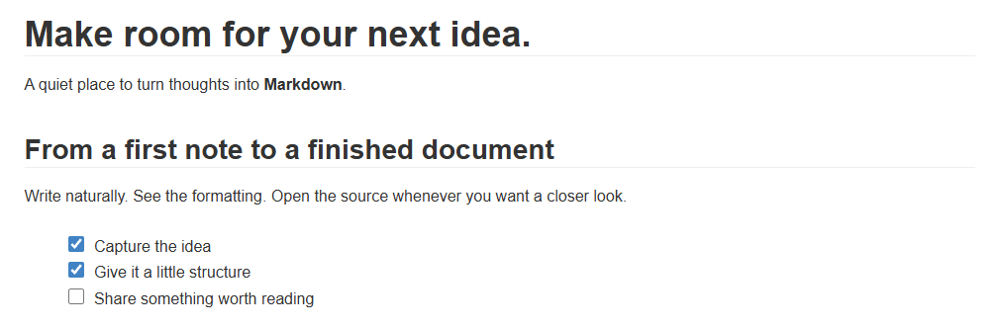
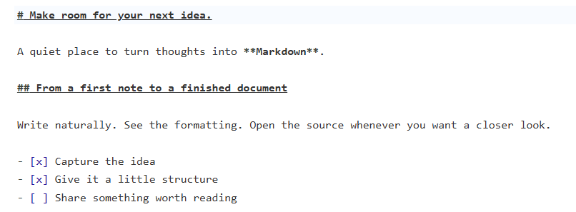
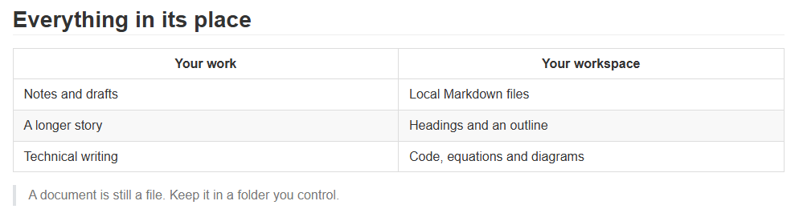
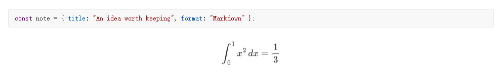
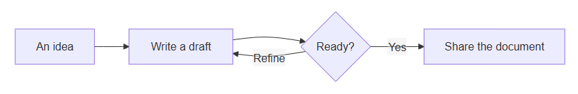
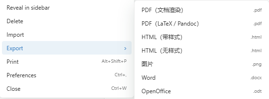
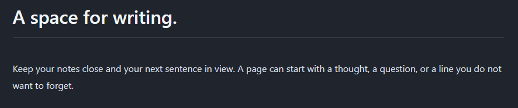

<p align="center"></p>

<h1 align="center">OpenTypora</h1>

<p align="center">给文字一点空间。让想法成为文档。</p>

<p align="center"><code>/* 阅读 · 写作 · Markdown */</code></p>

<p align="center"><strong>简体中文</strong> · <a href="README.preview.md">English</a></p>

<p align="center">
  <a href="https://github.com/Cjy-CN/OpenTypora/releases/download/v0.1.3/OpenTypora-Setup-0.1.3-x64.exe"><strong>下载 Windows 安装版</strong></a>
  &nbsp; · &nbsp;
  <a href="https://github.com/Cjy-CN/OpenTypora/releases/download/v0.1.3/OpenTypora-Portable-0.1.3-x64.exe">下载便携版</a>
  &nbsp; · &nbsp;
  <a href="https://github.com/Cjy-CN/OpenTypora/releases/latest">所有下载与更新说明</a>
</p>

<p align="center"><sub>Windows x64 · v0.1.3 · 免费开源 · MIT</sub></p>

<p align="center"></p>

<p align="center"><sub>从一页笔记，到一份完整文档。</sub><br><br></p>

---

<h2 align="center">阅读与写作，在同一页</h2>

<p align="center">打开文件，先看内容。点击段落，接着写。<br>离开当前段落，标题、列表和文字样式回到阅读时的样子。</p>

| 即时编辑 | 源码模式 | 专心写作 |
| :---: | :---: | :---: |
| 编辑正在处理的段落，直接看到格式。 | 用 `Ctrl+/` 查看 Markdown；共用原文和撤销历史。 | 专注模式淡化周边内容；打字机模式让当前行保持在视线附近。 |

<p align="center"></p>

<p align="center"><code>/* 一份原文，两种编辑视图。 */</code><br><br></p>

---

<h2 align="center">简单的文字，可以表达更多</h2>

<p align="center">标题 · 列表 · 任务 · 表格 · 图片 · 代码 · 公式 · 图表</p>

<p align="center">用 Markdown 组织内容，用代码围栏保存图表。<br>支持数学公式、Mermaid，以及传统 sequence 和 flow 图表；原文始终可以继续编辑。</p>

<h3 align="center">让信息井然有序</h3>

<p align="center">几行文字，组成一张表格。任务、分类和引用各有位置。</p>

<p align="center"></p>

<h3 align="center">代码与公式，写在文档里</h3>

<p align="center"></p>

<h3 align="center">把过程画出来</h3>

<p align="center"></p>

<p align="center"></p>

<p align="center"><code>/* 把过程画出来，把推导写清楚。 */</code><br><br></p>

---

<h2 align="center">把注意力留给内容</h2>

<p align="center">文件、大纲和搜索，都在写作旁边。</p>

| 文件就在身边 | 长文有路可循 | 修改有迹可查 |
| :--- | :--- | :--- |
| 打开 `.md` 文件，窗口自动关联所在目录。顶部按文件名过滤，也可以搜索目录内的内容。 | 大纲跟随标题生成，点击即可跳转；全文查找替换支持大小写、整词和正则表达式。 | 保存恢复草稿，检测外部文件变化；切换视图与主题继续使用同一份原文。 |

<table>
  <tr>
    <td align="center" valign="top"><strong>文件与过滤搜索</strong><br></td>
    <td align="center" valign="top"><strong>标题组成文档地图</strong><br></td>
  </tr>
</table>

<p align="center">文档是你自己目录里的普通文件。<br>不需要把内容导入专有数据库，就能开始写作。<br><br></p>

---

<h2 align="center">写完之后，分享出去</h2>

<p align="center">保留 Markdown，或交付一份适合阅读的成品。</p>

<p align="center"></p>

<p align="center"><strong>HTML · PDF · 图片</strong><br>内置桌面渲染器提供导出；可以按用途设置独立导出配置。</p>

<p align="center"><sub>Word、OpenDocument、RTF、Epub、LaTeX 等转换格式需要 Pandoc。<br>LaTeX PDF 还需要兼容的 TeX 引擎；缺少依赖时应用会提示配置方法。</sub><br><br></p>

---

<h2 align="center">选择你的纸张</h2>

<p align="center">明亮、暖色，或深色。换一种阅读氛围，继续写同一份文档。</p>

<p align="center"><strong>Newsprint</strong> · 暖色纸张，衬线文字。</p>

<p align="center"></p>

<p align="center"><strong>Night</strong> · 深色画布，清晰层次。</p>

<p align="center"></p>

<p align="center"><sub>内置 Github、Newsprint、Night、Pixyll、Whitey；支持自定义正文 CSS。<br>界面可跟随系统语言，或手动选择简体中文、英语。部分导出配置名称与错误提示仍为中文。</sub><br><br></p>

---

<h2 align="center">从一个文件开始</h2>

<p align="center"><a href="https://github.com/Cjy-CN/OpenTypora/releases/latest"><strong>获取已打包的 OpenTypora →</strong></a></p>

1. 在 Releases 的 **Assets** 中下载 `OpenTypora-Setup-0.1.3-x64.exe`，运行安装程序。无需 Node.js 或构建工具。
2. 从开始菜单启动，或右键 `.md` 文件选择 **使用 OpenTypora 打开**。Windows 11 上可能位于“显示更多选项”。
3. 按 `Ctrl+O` 打开文件、`Ctrl+S` 保存、`Ctrl+/` 切换源码模式。

安装版提供快捷方式、Markdown 右键打开入口、“打开方式”注册和卸载程序。卸载可在 Windows **设置 → 应用** 中完成；文档、设置与恢复数据保留。安装不会自动替换现有的 Markdown 默认编辑器。

便携版 `OpenTypora-Portable-0.1.3-x64.exe` 双击即可运行，不自动注册右键入口或卸载程序。便携打包不表示设置一定保存在 EXE 旁边。

<sub>当前提供 Windows x64 构建，产物尚未签名。Releases 中的 Source code 是源码压缩包；安装版和便携版请下载对应的 EXE。文件校验值见同一发布页的 SHA256SUMS.txt。</sub>

---

## 构建与贡献

开发环境：Windows x64、Node.js 24、npm。

```powershell
git clone https://github.com/Cjy-CN/OpenTypora.git
cd OpenTypora
npm ci
npm run dev
```

修改后运行相关检查：`npm test`、`npm run typecheck`、`npm run build`。桌面与真实编辑交互检查分别为 `npm run test:desktop`、`npm run test:editor`。`npm run package` 生成安装版，`npm run package:portable` 生成便携版；打包后可运行 `npm run test:installer` 验证安装与卸载。

参与前阅读 [协作约定](AGENTS.md) 和 [工程契约](docs/工程基线与协作契约.md)。通过 [Issues](https://github.com/Cjy-CN/OpenTypora/issues) 提交复现步骤和最小 Markdown 样例。

项目仍在积极开发。[产品需求](docs/OpenTypora-产品需求文档.md) 与 [验收用例](docs/OpenTypora-验收用例.md) 记录完整目标；这份功能介绍不表示所有验收用例已经通过。更多设置、依赖与工程资料见 [项目文档](docs/README.md)。

## 许可

OpenTypora 使用 [MIT 许可证](LICENSE)。第三方组件保留各自的许可。

<p align="center"><a href="https://github.com/Cjy-CN/OpenTypora/releases/latest">下载</a> · <a href="docs/README.md">文档</a> · <a href="https://github.com/Cjy-CN/OpenTypora/issues">反馈</a> · <a href="LICENSE">MIT</a></p>
