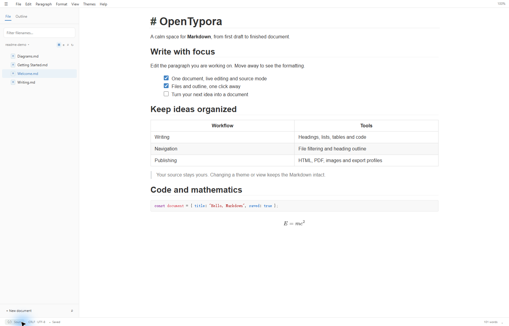
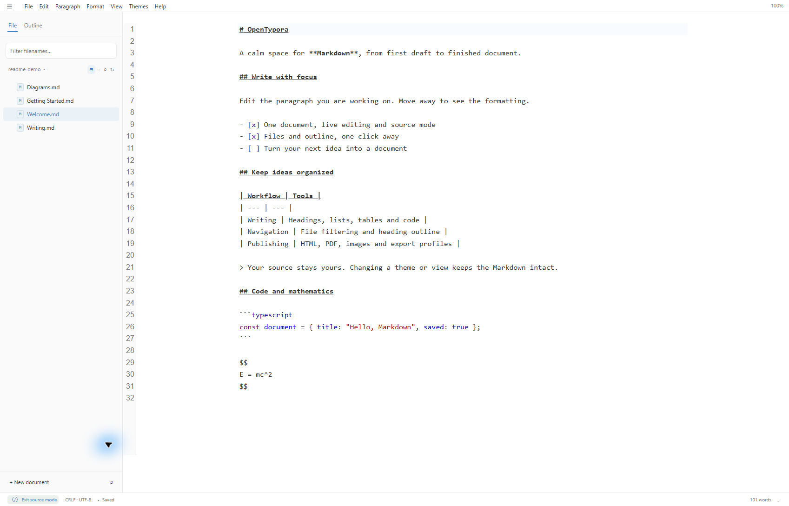
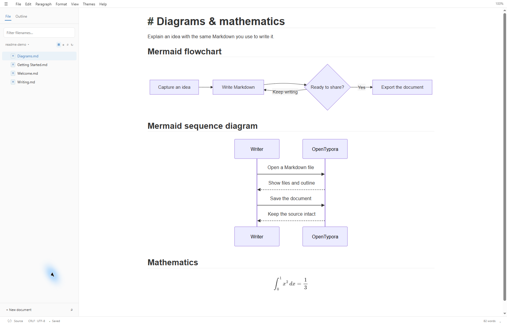
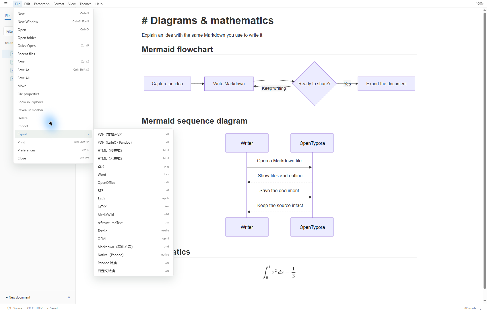

<h1 align="center">OpenTypora</h1>
<p align="center">在本地完成 Markdown 写作、阅读与导出。</p>
<p align="center"><a href="README.md">English</a> · <strong>简体中文</strong></p>
<p align="center">
  
  
  
</p>
<p align="center"><a href="#功能">功能</a> · <a href="#安装">安装</a> · <a href="#开发">开发</a> · <a href="docs/README.md">项目文档</a> · <a href="https://github.com/Cjy-CN/OpenTypora/issues">问题反馈</a></p>



OpenTypora 将 Markdown 文件、文档大纲和编辑工具放在同一个桌面窗口中。即时编辑与源码模式共享原文和撤销历史，文档始终是你自己目录中的普通文件。

项目正在持续开发。[产品需求文档](docs/OpenTypora-产品需求文档.md)与[验收用例](docs/OpenTypora-验收用例.md)记录完整交付目标；菜单中存在某个入口，不等于全部验收用例已经通过。

## 功能

| 领域 | 可以做什么 |
| --- | --- |
| 写作 | 编辑标题、强调、引用、列表、任务、表格、链接、图片和代码围栏，在即时编辑与源码模式之间切换。 |
| 导航 | 浏览文件或大纲；打开 Markdown 后自动关联其目录，在文件栏顶部过滤文件名。 |
| 搜索 | 查找和替换完整原文，使用大小写、全词及正则选项，或搜索当前目录中的文件内容。 |
| 技术文档 | 本地渲染数学公式、Mermaid、传统序列图和流程图，在无效源码旁显示错误。 |
| 外观 | 使用内置主题、自定义正文 CSS、专注模式、打字机模式和缩放。 |
| 文件保护 | 保存恢复草稿、检测外部修改，并在切换视图时保持源码与撤销历史一致。 |
| 导出 | 导出 HTML、渲染 PDF 和图片，为 Pandoc 与自定义转换器管理独立配置。 |
| Windows 集成 | 安装版注册 Markdown 右键入口和“打开方式”候选，通过 Windows 设置卸载。 |
| 界面语言 | 跟随系统，或手动选择简体中文、英语。 |

### 一份原文，两种编辑视图

日常写作用即时编辑，需要精确调整 Markdown 时切换源码模式。视图切换不会创建第二份文档，文件和大纲导航始终位于正文旁。



### 图表与数学公式

将图表写在 Markdown 代码围栏中。Mermaid、传统序列图与流程图，以及数学表达式都在本地渲染，同时保留可编辑的 Markdown 源码。



### 导出配置

“文件 → 导出”子菜单列出可用配置。在“偏好设置 → 导出”中调整纸张、边距、样式和转换器参数。



HTML、渲染 PDF 和图片由内置桌面渲染器生成。Word、OpenDocument、RTF、Epub、LaTeX 等转换格式需要 **Pandoc**；LaTeX PDF 还需要兼容的 **TeX 引擎**。缺少依赖时会显示错误和所需的处理方式。

## 安装

### Windows 安装版

使用已发布[发行版本](https://github.com/Cjy-CN/OpenTypora/releases)中的 `OpenTypora-Setup-<版本>-x64.exe`，或者按下方步骤自行构建。发行文件的访问权限与仓库访问权限一致。

1. 运行安装程序，选择目录。安装范围为当前 Windows 用户。
2. 从开始菜单、桌面快捷方式或安装目录启动 OpenTypora。
3. 右键点击 `.md` 文件，选择**用 OpenTypora 打开**。Windows 11 下该入口可能位于**显示更多选项**中；OpenTypora 同时注册为**打开方式**候选。

安装保留现有的 Markdown 默认编辑器。如果希望设为默认应用，可通过 Windows“打开方式 → 选择其他应用”选择。

**卸载：**在 Windows“设置 → 应用 → 已安装的应用”中找到 OpenTypora 并选择卸载；也可以运行安装目录中的 `Uninstall OpenTypora.exe`。卸载移除程序、快捷方式及其文件打开注册，保留文档、设置和恢复数据。

### 便携版

`OpenTypora-Portable-<版本>-x64.exe` 不经过安装向导，直接运行。便携版不会自动添加安装版的右键入口或卸载程序，不再需要时删除便携 EXE 即可。“便携打包”不表示设置一定保存在 EXE 旁。

## 快速开始

1. 使用 **Ctrl+O** 打开 Markdown 文件，或者使用 **Ctrl+N** 新建文档。
2. **文件**栏显示当前目录，过滤文件名查找其他文档；切换至**大纲**按标题定位。
3. 在正文中写作，使用 **Ctrl+S** 保存，使用 **Ctrl+/** 查看或编辑源码。
4. 选择主题、调整偏好设置，或通过“**文件 → 导出**”生成输出。

| 快捷键 | 操作 |
| --- | --- |
| Ctrl+N / Ctrl+Shift+N | 新建文档 / 新建窗口 |
| Ctrl+O / Ctrl+S / Ctrl+Shift+S | 打开 / 保存 / 另存为 |
| Ctrl+P | 快速打开文档 |
| Ctrl+F / Ctrl+H | 查找 / 替换 |
| Ctrl+Shift+F | 搜索当前目录的文件内容 |
| Ctrl+/ | 切换源码模式 |
| Ctrl+, | 偏好设置 |
| F8 / F9 | 专注模式 / 打字机模式 |

## 配置

偏好设置按文件、编辑器、图像、Markdown、导出、外观和通用分组。可以搜索设置、逐项重置，或者通过使用同一校验规则的高级 JSON 视图编辑。

- **界面语言：**“通用 → 界面语言”对新配置默认选择**跟随系统**。中文系统语言使用简体中文，其他语言回退英语；已有手动选择会保留。部分导出配置名称与错误提示仍为中文。
- **图片：**选择不处理、复制到资源目录或使用已配置的上传适配器。上传需要对应服务或可执行程序。
- **主题：**选择内置主题，或提供只作用于正文的 CSS。
- **转换器：**配置 Pandoc、TeX 程序和需要的导出配置。
- **恢复：**恢复草稿与自动覆盖原文件是两个独立选项。

## 开发

需要 **Windows x64**、**Node.js 24** 和 npm。原生集成、安装包及桌面检查在 Windows 上运行。

```powershell
git clone https://github.com/Cjy-CN/OpenTypora.git
cd OpenTypora
npm ci
npm run dev
```

| 命令 | 用途 |
| --- | --- |
| `npm run dev` | 启动桌面开发应用 |
| `npm run dev:web` | 启动不包含特权桌面服务的网页界面 |
| `npm test` | 单元和集成测试 |
| `npm run typecheck` | 检查 TypeScript 类型 |
| `npm run build` | 构建前端与 Electron 入口 |
| `npm run test:desktop` | 使用隐藏窗口和隔离数据验证真实桌面应用 |
| `node electron/services/run-render-smoke.mjs` | 验证桌面渲染与服务操作 |
| `npm run package` | 在 `release/` 生成 Windows x64 安装包 |
| `npm run package:portable` | 生成可选的 Windows x64 便携 EXE |
| `npm run test:installer` | 打包后，在独立注册表区域和临时目录验证安装与卸载 |

仓库尚未配置生产代码签名，分发时需配置自己的签名身份。实现和验证细节见 [Windows 安装与卸载](docs/Windows-安装与卸载.md)。

### 项目结构

```text
src/core/          文档事务、源码位置与命令
src/editor/        即时编辑、源码模式与编辑操作
src/render/        Markdown、公式与图表渲染
src/ui/            工作区、菜单、偏好设置与翻译
src/platform/      桌面桥接调用与文件/会话协调
src/shared/        共享契约、设置与命令定义
electron/          主进程、预加载与特权服务
build/             Windows 安装程序集成
scripts/           开发、构建与安装验证工具
tests/             跨模块回归测试
docs/              产品、工程与验收文档
```

文档源码是单个 Markdown 字符串，位置使用 UTF-16 偏移，编辑通过 `DocumentStore` 事务执行。特权操作通过 `DesktopBridge` 完成，文档 HTML 不具有 Node 访问或任意 IPC 能力。

## 参与贡献

修改前阅读 [AGENTS.md](AGENTS.md)、[工程契约](docs/工程基线与协作契约.md)及相关需求。报告问题时提供复现步骤和最小 Markdown 样例。让修复保持聚焦，保留源码与撤销行为，并运行相关工作流的检查。

通过 [Issues](https://github.com/Cjy-CN/OpenTypora/issues)提交可复现的问题或建议，不要在报告和截图中包含凭据或私有文档。

## 许可

OpenTypora 使用 [MIT 许可证](LICENSE)。第三方组件保留各自许可，打包产物中包含相应许可说明。
