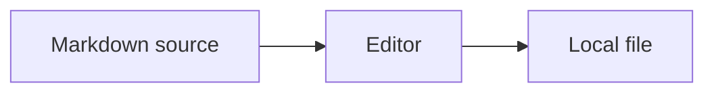
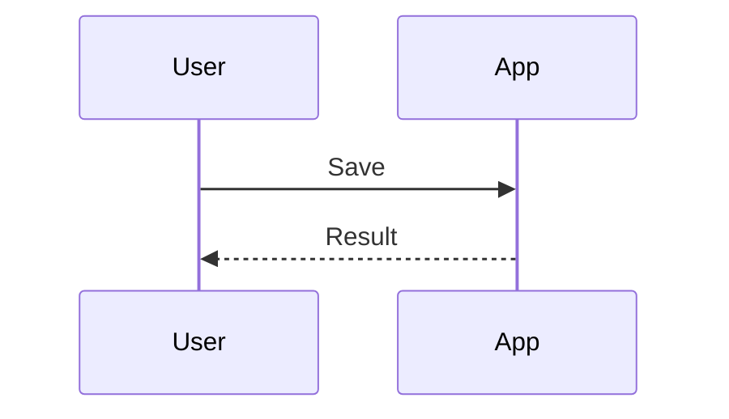

# 扩展功能样例

本样例只用于独立验收，不表示已在参考 Typora 中实测。

[TOC]

## 行内与引用

**粗体中的 *斜体***，~~删除线~~，<u>下划线</u>，==高亮==，H~2~O，x^2^。

包含反引号的代码：``a ` b``。转义管道：\|。转义星号：\*。

[引用式链接][reference]，重复脚注[^note]，再次引用[^note]。

[reference]: https://example.com "示例链接"
[^note]: 脚注正文，含 **强调**。

<!-- 保留注释，不在阅读排版中当普通正文输出。 -->

## 五类警告框

> [!NOTE]
> 提醒。

> [!TIP]
> 建议。

> [!IMPORTANT]
> 重要。

> [!WARNING]
> 警告。

> [!CAUTION]
> 注意。

> [!UNKNOWN]
> 未知类型保留引用结构。

## 图片


## 表格与嵌套列表

| 左对齐 | 居中 | 右对齐 |
| :--- | :---: | ---: |
| 中文 | **强调** | 12 |
| `a\|b` | [链接](#图片) | 12345 |
|  | 空字段 | 0 |

1. 第一项
   - 子项
     - [ ] 待完成
     - [x] 已完成

   同一项目中的第二段。

   > 项目中的引用。

2. 第二项

## 代码与公式

```python
def example(value):
    text = "中文 🙂 **字面星号**"
    return value + 1
```

```unknown-language
Unknown language keeps all literal text.
```

行内：$a^2+b^2=c^2$。普通货币：价格 $10 与 $20。

$$
\begin{aligned}
f(x) &= x^2 \\
f'(x) &= 2x
\end{aligned}
$$

\(x+y\) 与 \[x-y\]。

```math
E = mc^2
```

## 三类图表

```sequence
Alice->Bob: Request
Bob-->Alice: Response
```

```flow
st=>start: Start
op=>operation: Edit
e=>end: Save
st->op->e
```





## 空白与换行

单换行的第一行
第二行。

显式换行的第一行  
第二行。

连续空格：A    B。HTML换行：A<br/>B。

## 同名标题

内容一。

## 同名标题

内容二，用于锚点区分测试。
