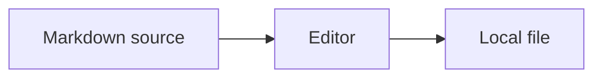

# Diagram Compare

```sequence
Title: Request
participant Alice as Alice
participant Bob as Bob
Alice->Bob: Request
Bob-->Alice: Response
Note right of Bob: Done
```

```flow
st=>start: Start
op=>operation: Edit
cond=>condition: Save?
e=>end: Save
st->op->cond
cond(yes)->e
```


